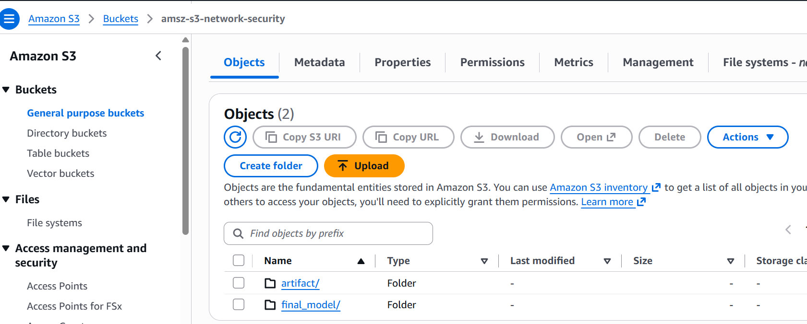
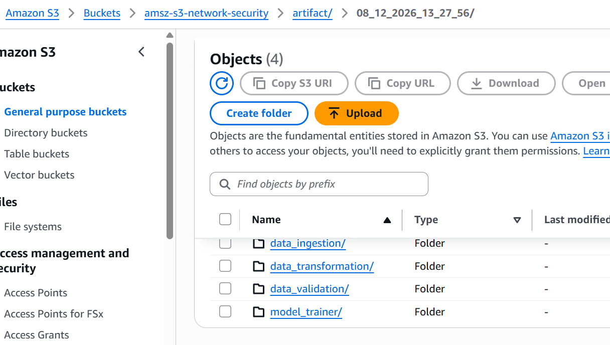
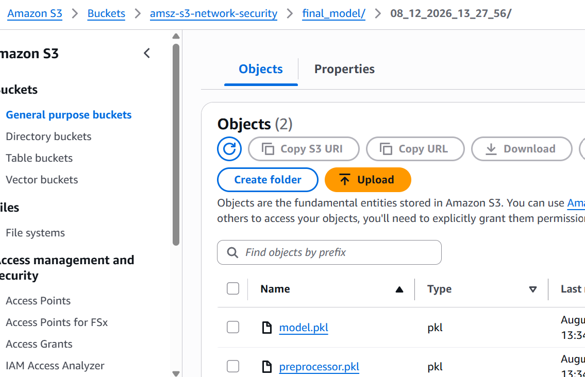
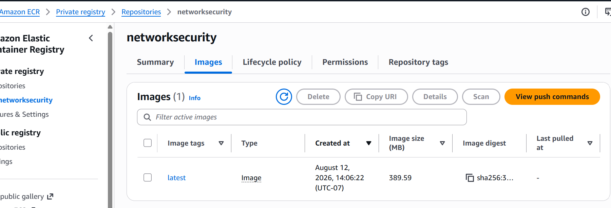
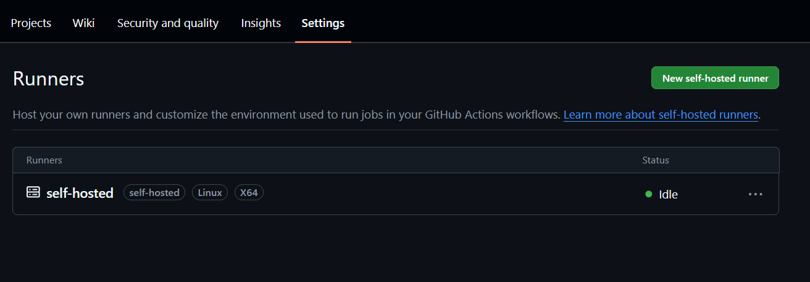
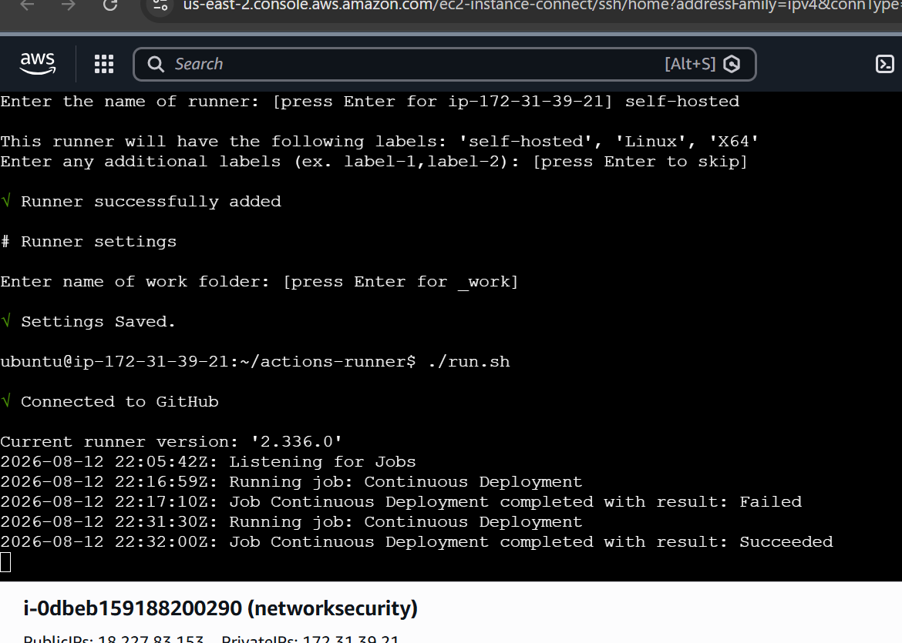
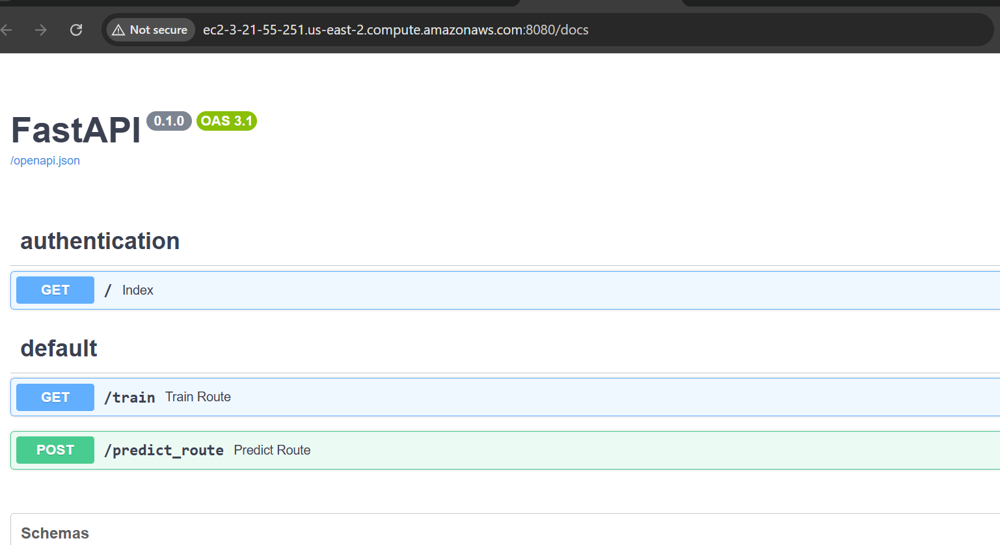
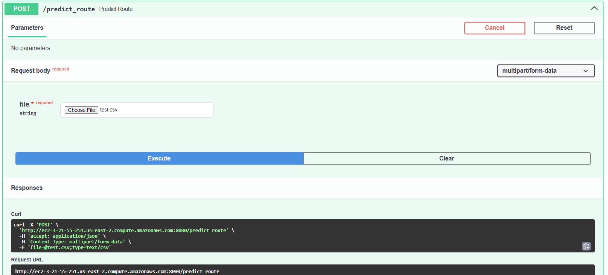
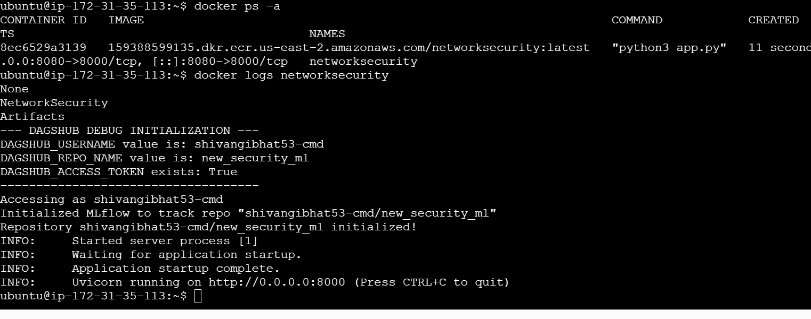

# Network Security ML — Phishing Data Detection

An end-to-end machine learning pipeline that detects phishing/malicious network activity from structured network traffic data. The project covers the full ML lifecycle — data ingestion from MongoDB, validation, transformation, model training with experiment tracking — and is fully productionized with a FastAPI serving layer, Docker containerization, artifact/model syncing to AWS S3, and a GitHub Actions CI/CD pipeline that builds, pushes, and deploys the app to an EC2 instance via a self-hosted runner.

---

## Table of Contents

- [Live Demo](#live-demo)
- [Overview](#overview)
- [Architecture](#architecture)
- [Project Structure](#project-structure)
- [Tech Stack](#tech-stack)
- [Setup & Installation](#setup--installation)
- [Configuration](#configuration)
- [Usage](#usage)
  - [Loading Data into MongoDB](#loading-data-into-mongodb)
  - [Running the Training Pipeline](#running-the-training-pipeline)
  - [Running the API Server](#running-the-api-server)
- [API Reference](#api-reference)
- [Code Reference](#code-reference)
- [Docker](#docker)
- [Experiment Tracking](#experiment-tracking)
- [Cloud Deployment (AWS)](#cloud-deployment-aws)
  - [S3 — Artifact & Model Sync](#s3--artifact--model-sync)
  - [ECR — Container Registry](#ecr--container-registry)
  - [EC2 — Hosting](#ec2--hosting)
- [CI/CD Pipeline (GitHub Actions)](#cicd-pipeline-github-actions)
- [Full Setup Walkthrough](#full-setup-walkthrough)
- [Troubleshooting Log](#troubleshooting-log)
- [Security Notes](#security-notes)
- [Known Issues / TODO](#known-issues--todo)
- [Author](#author)

---
## Live Demo

The app is deployed on AWS EC2 and reachable here:

🔗 http://ec2-3-21-55-251.us-east-2.compute.amazonaws.com:8080/docs

⚠️ Note: This is hosted on a free-tier AWS account. If the link doesn't load, the free tier has likely expired/the instance has been stopped — it isn't guaranteed to run indefinitely. Feel free to clone the repo and run it locally or on your own AWS account in that case (see Setup & Installation and Cloud Deployment (AWS)).

---
## Overview

This project trains a classifier that flags network traffic records as phishing/malicious vs. legitimate, based on a set of engineered features (URL/domain characteristics typical of phishing datasets). It is built as a reusable Python package (`networksecurity`) with a clearly separated pipeline architecture, rather than a single monolithic script, so that each stage (ingestion, validation, transformation, training) can be run, tested, or swapped independently.

Once trained, the model artifacts (preprocessor + estimator) are:
1. Synced to an **AWS S3** bucket for durable storage,
2. Served through a **FastAPI** app that accepts a CSV upload and returns predictions, and
3. Shipped automatically on every push via a **GitHub Actions → AWS ECR → AWS EC2** CI/CD pipeline.

---

## Architecture

**Training & Serving Flow**

```
MongoDB (raw records)
        │
        ▼
 ┌────────────────┐
 │ Data Ingestion  │  → pulls data from MongoDB, splits train/test
 └────────────────┘
        │
        ▼
 ┌────────────────┐
 │ Data Validation │  → schema checks, drift detection (schema.yaml)
 └────────────────┘
        │
        ▼
 ┌───────────────────┐
 │ Data Transformation│ → cleaning, KNN imputation, preprocessing pipeline
 └───────────────────┘
        │
        ▼
 ┌────────────────┐
 │  Model Trainer  │  → GridSearchCV across models, logs to MLflow/DagsHub
 └────────────────┘
        │
        ▼
 artifacts/ + final_model/ (preprocessor.pkl, model.pkl)
        │
        ├────────────► AWS S3 bucket (artifact + model backup)
        │
        ▼
   FastAPI (app.py) → /train, /predict_route
```

**Deployment Flow**

```
Push to GitHub (main branch)
        │
        ▼
 GitHub Actions: Continuous Integration
   (basic checks)
        │
        ▼
 GitHub Actions: Continuous Delivery
   docker build → docker push → AWS ECR
        │
        ▼
 GitHub Actions: Continuous Deployment
   (runs on self-hosted runner living on EC2)
   docker pull latest image from ECR
   docker run -d -p 8080:8000 ...
        │
        ▼
   EC2 instance serves the app publicly on :8080
```

Each pipeline stage reads a typed **config entity** and produces a typed **artifact entity**, which is passed into the next stage — a common pattern for keeping ML pipelines auditable and testable.

---

## Project Structure

```
.
├── app.py                        # FastAPI app: serves training + prediction endpoints
├── main.py                       # CLI entry point that runs the full training pipeline
├── push_data.py                  # One-off script to load a local CSV into MongoDB
├── test_mongodb.py               # Standalone MongoDB connectivity sanity check
├── setup.py                      # Packaging config (installs `networksecurity` as a package)
├── requirements.txt              # Python dependencies (ends with `-e .`)
├── Dockerfile                    # Container build definition
├── .env                          # Environment variables (MongoDB URI, DagsHub creds) — NOT committed
├── .gitignore
├── README.md
│
├── .github/
│   └── workflows/
│       └── main.yaml             # CI/CD: build → ECR push → EC2 deploy
│
├── network_data/
│   └── phisingData.csv           # Source dataset for push_data.py
│
├── artifacts/                    # Timestamped pipeline run outputs (ingested data, transformed data, etc.)
├── final_model/                  # preprocessor.pkl + model.pkl (latest trained model)
├── prediction_output/            # output.csv from the /predict_route endpoint
├── templates/
│   └── table.html                # Jinja2 template used by /predict_route
│
└── networksecurity/              # Core package
    ├── components/
    │   ├── data_ingestion.py
    │   ├── data_validation.py
    │   ├── data_transformation.py
    │   └── model_trainer.py
    ├── pipeline/
    │   └── training_pipeline.py  # Orchestrates all components + syncs artifacts/model to S3
    ├── cloud/
    │   └── s3_syncer.py          # Helper class to sync local folders <-> S3 bucket
    ├── entity/
    │   ├── config_entity.py      # DataIngestionConfig, DataValidationConfig, etc.
    │   └── artifact_entity.py    # DataIngestionArtifact, DataValidationArtifact, etc.
    ├── constant/
    │   └── training_pipeline/    # DATA_INGESTION_COLLECTION_NAME, DATA_INGESTION_DATABASE_NAME, schema.yaml path, etc.
    ├── utils/
    │   ├── main_utils/
    │   │   └── utils.py          # load_object() and other shared helpers
    │   └── ml_utils/
    │       └── model/
    │           └── estimator.py  # NetworkModel wrapper (preprocessor + model)
    ├── exception/
    │   └── exception.py          # NetworkSecurityException (wraps sys.exc_info() for file/line-level errors)
    └── logging/
        └── logger.py             # Project-wide logging config

data_schema/
└── schema.yaml                   # Column names, dtypes, and numerical_columns used in Data Validation
```

> **Note:** The `networksecurity/` package contains the actual pipeline logic and is imported throughout `app.py`. Its internal implementation isn't reproduced line-by-line here — see inline docstrings/comments in each module.

---

## Tech Stack

| Category              | Tools |
|------------------------|-------|
| Language               | Python 3.10 / 3.11 |
| Data storage            | MongoDB Atlas |
| Data processing          | pandas, numpy |
| ML                      | scikit-learn (GridSearchCV for hyperparameter tuning) |
| Experiment tracking     | MLflow, DagsHub |
| API framework            | FastAPI, Uvicorn |
| Serialization            | pickle |
| Config format             | pyaml (`schema.yaml`) |
| Containerization          | Docker |
| Cloud storage             | AWS S3 (artifact + model backups) |
| Container registry        | AWS ECR |
| Compute / hosting          | AWS EC2 (Ubuntu) |
| CI/CD                    | GitHub Actions (self-hosted runner on EC2) |

---

## Setup & Installation

### 1. Clone the repository
```bash
git clone <repo-url>
cd <repo-folder>
```

### 2. Create a conda environment

```bash
conda create -p venv python==3.11 -y
conda activate venv/
```

### 3. Install dependencies
```bash
pip install -r requirements.txt
```
`requirements.txt` ends with `-e .`, so `pip` also builds and installs the local `networksecurity` package in **editable mode**. This creates a `networksecurity.egg-info` folder and a symlink back to your project directory instead of a static copy — so any change you make to the package code is picked up immediately without reinstalling. It's also what lets you `import networksecurity...` from any file in the repo, even ones you open and run directly (e.g. for debugging `data_transformation.py` in isolation).

### 4. Set up environment variables
Create a `.env` file in the project root (see [Configuration](#configuration) below).

---

## Configuration

The project reads secrets from a `.env` file via `python-dotenv`. Required variables:

| Variable | Description |
|---|---|
| `MONGODB_URI` | MongoDB Atlas connection string used for data ingestion and prediction storage |
| `DAGSHUB_USERNAME` | DagsHub account username, for MLflow tracking |
| `DAGSHUB_REPO_NAME` | DagsHub repository name, for MLflow tracking |
| `DAGSHUB_ACCESS_TOKEN` | DagsHub access token, for authenticated experiment logging |

Example `.env`:
```env
MONGODB_URI="mongodb+srv://<username>:<password>@<cluster>.mongodb.net"
DAGSHUB_USERNAME="<your-dagshub-username>"
DAGSHUB_REPO_NAME="<your-dagshub-repo>"
DAGSHUB_ACCESS_TOKEN="<your-dagshub-token>"
```

For AWS access (S3 sync, ECR push, EC2 deploy) configure the AWS CLI locally:
```bash
aws configure
# AWS Access Key ID, Secret Access Key, Default region, output format
```
And add the following as **GitHub Actions repository secrets** (Settings → Secrets and variables → Actions):

| Secret | Description |
|---|---|
| `AWS_ACCESS_KEY_ID` | IAM user access key (Administrator access, for CI/CD) |
| `AWS_SECRET_ACCESS_KEY` | IAM user secret key |
| `AWS_REGION` | e.g. `us-east-2` |
| `AWS_ECR_LOGIN_URI` | Your ECR repository URI |
| `AWS_ECR_LOGIN_URI_DEP` | Your ECR repository URI without /reponame
| `ECR_REPOSITORY_URI`    | ECR repo name
| `MONGODB_URI` | Same MongoDB Atlas URI used locally |
| `DAGSHUB_USERNAME` | Same DagsHub username used locally |
| `DAGSHUB_REPO_NAME` | Same DagsHub repo name used locally |
| `DAGSHUB_ACCESS_TOKEN` | Same DagsHub access token used locally |

> **Local vs. production config:** locally, `MONGODB_URI`, `DAGSHUB_USERNAME`, `DAGSHUB_REPO_NAME`, and `DAGSHUB_ACCESS_TOKEN` are loaded from `.env` via `python-dotenv`. In production, `.env` is never baked into the Docker image or committed, so these same four variables are instead stored as **GitHub Actions repository secrets** and injected into the container at deploy time by the Continuous Deployment job in `.github/workflows/main.yml` (e.g. passed with `docker run -e MONGODB_URI=... -e DAGSHUB_USERNAME=... ...` or an equivalently generated env file on the runner). See [CI/CD Pipeline](#cicd-pipeline-github-actions) for where this happens in the workflow.

> ⚠️ **Never commit `.env` with real credentials.** Make sure it's listed in `.gitignore` and rotate any credentials that have ever been exposed (see [Security Notes](#security-notes)).

---

## Usage

### Loading Data into MongoDB

`push_data.py` reads a local CSV of phishing data, converts it to JSON records, and bulk-inserts it into a MongoDB collection.

1. Set up a MongoDB Atlas cluster (free tier `cluster0` works fine).
2. Under **Network Access**, add `0.0.0.0/0` to the IP access list so the app/CI can connect from anywhere (fine for dev; scope this down for production).
3. Copy your connection string into `.env` as `MONGODB_URI`.
4. Place your source CSV (e.g. `phisingData.csv`) under `network_data/`.
5. Run:
```bash
python push_data.py
```
This uses `certifi` to validate TLS/SSL against MongoDB, converts each row to a JSON record via `NetworkDataExtract.cv_to_json_convertor()`, and inserts them into the configured database/collection with `insert_data_mongodb()`. Verify the load under **Browse Collections** in Atlas.

You can sanity-check plain connectivity first with:
```bash
python test_mongodb.py
```

### Running the Training Pipeline

Run the full ingestion → validation → transformation → training pipeline from the command line:
```bash
python main.py
```
This will:
1. **Data Ingestion** — pull data from MongoDB, save it as `artifacts/feature_store/raw.csv`, then split it into `artifacts/ingested/train.csv` and `test.csv`.
2. **Data Validation** — check the number/type of features against `data_schema/schema.yaml`, and check for data drift (distribution shift) on numerical columns.
3. **Data Transformation** — load `schema.yaml`, apply a `KNNImputer`-based preprocessing pipeline (no resampling like SMOTE is needed since the dataset is balanced), and save `preprocessor.pkl`.
4. **Model Trainer** — run `GridSearchCV` across candidate models, evaluate on precision/recall/F1, log the run to MLflow (backed by DagsHub), and save the best model as `model.pkl` under `final_model/`.

To inspect experiment:
Before running the training pipeline for the first time, make sure your local machine is authenticated with DagsHub so MLflow can capture experiment runs correctly. Run `dagshub.init(repo_owner="<DAGSHUB_USERNAME>", repo_name="<DAGSHUB_REPO_NAME>", mlflow=True)` once (or let `model_trainer.py` do it on import) — this will prompt you to log in to DagsHub in your browser and link the session to your repo. It's also worth making sure your project folder is a proper Git repository connected to your GitHub remote, since `dagshub.init()` falls back to inspecting the local `.git` folder to resolve the repo when the `DAGSHUB_USERNAME`/`DAGSHUB_REPO_NAME` environment variables aren't set. Once this is done, every training run will automatically log its metrics, parameters, and model artifacts to your DagsHub repo's MLflow tracking server, viewable either in the local MLflow UI or directly on DagsHub

### Running the API Server

Start the FastAPI app:
```bash
python app.py
```
or, for auto-reload during development:
```bash
uvicorn app:app --host 0.0.0.0 --port 8000 --reload
```

By default the app runs on `http://localhost:8000`. Visit `http://localhost:8000/docs` for interactive Swagger documentation.

---

## API Reference

| Method | Endpoint | Description |
|---|---|---|
| `GET` | `/` | Redirects to `/docs` (Swagger UI) |
| `GET` | `/train` | Triggers `TrainingPipeline().run_pipeline()` and retrains the model |
| `POST` | `/predict_route` | Accepts a CSV file upload, runs predictions using the saved model, returns an HTML results table |

### `POST /predict_route`
- **Input:** multipart form-data file upload (`file`) — a CSV with the same feature columns used in training.
- **Process:**
  1. Loads `final_model/preprocessor.pkl` and `final_model/model.pkl`
  2. Wraps them in a `NetworkModel` and generates predictions
  3. Appends a `predicted_column` to the uploaded data
  4. Saves the result to `prediction_output/output.csv`
  5. Renders the result as an HTML table (via `templates/table.html`)
- **Output:** HTML page displaying the prediction table.

---

## Docker

Build and run the project in a container:

```bash
docker build -t networksecurity .
docker run -d -p 8080:8000 --env-file .env --ipc="host" --name=networksecurity networksecurity
```

> Note the port mapping: Uvicorn/`app.py` listens on **8000 inside the container**. Map the host's public port (e.g. `8080`, opened in the EC2 security group) to container port `8000` — not to `8080` on both sides, which is a mismatch that silently breaks external access (see [Troubleshooting Log](#troubleshooting-log)).

The `Dockerfile`:
- Uses `python:3.10-slim-bookworm` as the base image
- Installs `awscli` **and `git`** at the OS level — `git` is required at runtime, not just for CI, because `dagshub.init()` inspects the working directory for a `.git` folder to resolve the repo
- Installs Python dependencies from `requirements.txt`
- Copies the project into `/app`
- Runs `python3 app.py` as the container's entry point (equivalent to `uvicorn app:app` locally, since `app.py`'s `__main__` block calls `app_run` from uvicorn)

---

## Experiment Tracking

Model training runs are tracked with **MLflow**, backed by **DagsHub** as the remote tracking server. Each run logs `f1_score`, `precision`, and `recall` as metrics and the trained model itself via `mlflow.sklearn.log_model()`:

```python
def track_mlflow(self, best_model, classificationmetric):
    os.environ["MLFLOW_ALLOW_FILE_STORE"] = "true"
    mlflow.set_tracking_uri("./mlruns")
    with mlflow.start_run():
        mlflow.log_metric('f1_score', classificationmetric.f1_score)
        mlflow.log_metric('precision', classificationmetric.precision)
        mlflow.log_metric('recall', classificationmetric.recall)
        mlflow.sklearn.log_model(sk_model=best_model, name='model')
```

Authentication to DagsHub uses the `DAGSHUB_USERNAME`, `DAGSHUB_REPO_NAME`, and `DAGSHUB_ACCESS_TOKEN` environment variables (via `dagshub.init(..., mlflow=True)`), and runs can be viewed either in the local MLflow UI or directly on your DagsHub repo page.

---

## Cloud Deployment (AWS)

### S3 — Artifact & Model Sync
After each training run, the `artifacts/` folder and `final_model/` folder are synced to an S3 bucket using a small sync helper (`networksecurity/cloud/s3_syncer.py`), invoked from `training_pipeline.py`. This gives you durable, versioned backups of every run's data and model outside of the EC2/container filesystem, which is ephemeral.

Prerequisites:
- AWS CLI installed and configured (`aws configure`) with an IAM user that has sufficient S3 permissions.
- An S3 bucket created with a name matching what's referenced in the code.

### ECR — Container Registry
The trained app is packaged into a Docker image and pushed to a **private** AWS ECR repository.

1. In the AWS Console, go to **ECR → Create repository**, name it (e.g. `networksecurity`).
2. Copy the repository URI — this is used in the CI/CD workflow to tag and push images.

### EC2 — Hosting
An Ubuntu EC2 instance runs the container and serves the API.

**One-time Docker setup on the instance:**
```bash
# Update packages
sudo apt-get update -y && sudo apt-get upgrade -y

# Download and install Docker cleanly
curl -fsSL https://get.docker.com -o get-docker.sh
sudo sh get-docker.sh
rm get-docker.sh

# Add your user to the Docker group 
sudo usermod -aG docker $USER

# Apply group permissions
sg docker -c "docker ps"
```

**AWS CLI on the instance** (needed so the self-hosted GitHub Actions runner can authenticate to ECR):
```bash
sudo apt-get install -y awscli
```

**Security group:** open the port your container publishes on (e.g. `8080`) for inbound traffic so the API is reachable externally.

Once running, the app is reachable at:
```
http://<ec2...compute.amazonaws.com>:8080/docs
```

---

## CI/CD Pipeline (GitHub Actions)

`.github/workflows/main.yaml` defines a three-stage pipeline, gated so each stage only runs if the previous one succeeds:

| Job | Runs on | Responsibility |
|---|---|---|
| **Continuous Integration** | GitHub-hosted runner | Basic checks on the codebase |
| **Continuous Delivery** | GitHub-hosted runner | `docker build` the image and `docker push` it to AWS ECR |
| **Continuous Deployment** | **Self-hosted runner** (installed on the EC2 instance) | Pulls the latest image from ECR and runs it as a container on EC2 |

**Required repository secrets:** `AWS_ACCESS_KEY_ID`, `AWS_SECRET_ACCESS_KEY`, `AWS_REGION`, your ECR repository URI/name, **and the four app-config values** (`MONGODB_URI`, `DAGSHUB_USERNAME`, `DAGSHUB_REPO_NAME`, `DAGSHUB_ACCESS_TOKEN`). The AWS secrets authenticate the pipeline itself (ECR push, EC2 access); the app-config secrets are what the Continuous Deployment job passes into the running container in place of the local `.env` file, since `.env` isn't part of the image. Check `.github/workflows/main.yml` for the exact `docker run` invocation and how each secret is wired in (typically via `${{ secrets.<NAME> }}` references and `-e` flags or an env-file generated on the runner).

**Setting up the self-hosted runner:**
1. In your GitHub repo, go to **Settings → Actions → Runners → New self-hosted runner**, choose Linux.
2. Run the generated registration commands on the EC2 instance (via EC2 Instance Connect or SSH).
3. The runner registers as a background listener for workflow events targeting `runs-on: self-hosted`.

**Deployment job (conceptually):**
```bash
docker pull <ecr-uri>/networksecurity:latest
docker run -d -p 8080:8000 --ipc="host" --name=networksecurity <ecr-uri>/networksecurity:latest
```

Once everything is wired up, a normal `git push` to `main` triggers: build → push to ECR → pull + run on EC2, with zero manual deployment steps.

---

## Code Reference

This section documents the actual contents of each uploaded root-level file, verified directly against the source — not inferred.

### `app.py`
FastAPI application entry point.
- Creates a `pymongo.MongoClient(mongo_db_url, tlsCAFile=ca)` at **module import time** (`ca = certifi.where()`), so a bad/missing URI fails fast on startup.
- Imports `DATA_INGESTION_COLLECTION_NAME` and `DATA_INGESTION_DATABASE_NAME` from `networksecurity.constant.training_pipeline` to select the Mongo `database`/`collection` objects (unused elsewhere in this file, but establishes the connection is scoped to the ingestion collection).
- Registers `CORSMiddleware` with `allow_origins=["*"]`, `allow_credentials=True`, `allow_methods=["*"]`, `allow_headers=["*"]`.
- Uses `Jinja2Templates(directory="./templates")` — so a `templates/table.html` file is expected to exist relative to wherever `app.py` runs.
- **Routes:**
  - `GET /` (`tags=["authentication"]`) → `RedirectResponse(url='/docs')`
  - `GET /train` → instantiates `TrainingPipeline()` and calls `.run_pipeline()`; returns `Response("Training is successful")` on success, otherwise raises `NetworkSecurityException(e, sys)`
  - `POST /predict_route(request: Request, file: UploadFile = File(...))` →
    1. `pd.read_csv(file.file)`
    2. `load_object(file_path="final_model/preprocessor.pkl")` and `load_object(file_path="final_model/model.pkl")` — both **relative paths**, so the app must be run from the directory containing `final_model/`
    3. Wraps both in `NetworkModel(preprocessor=..., model=...)` and calls `.predict(df)`
    4. Appends result as `df['predicted_column']`
    5. Writes `df.to_csv('prediction_output/output.csv')` (also relative — `prediction_output/` must exist beforehand, the code doesn't create it)
    6. Converts `df` to an HTML table via `df.to_html(classes='table table-striped')` and renders it into `table.html` via `TemplateResponse`
- `if __name__ == "__main__":` → `app_run(app, host="0.0.0.0", port=8000)` (uvicorn's `run`, aliased on import)

### `main.py`
CLI entry point for the training pipeline (no FastAPI involved).
- Imports each pipeline component directly: `DataIngestion`, `DataValidation`, `DataTransformation`, `ModelTrainer`, plus their matching config classes (`DataIngestionConfig`, `DataValidationConfig`, `DataTransformationConfig`, `ModelTrainerConfig`, `TrainingPipelineConfig`) and artifact classes (`DataIngestionArtifact`, `DataValidationArtifact`, `ModelTrainerArtifact`).
- Sequential flow, each stage's config takes the shared `TrainingPipelineConfig` instance:
  ```python
  data_pipeline_config = TrainingPipelineConfig()
  data_ingestion = DataIngestion(DataIngestionConfig(data_pipeline_config))
  data_ingestion_artifact = data_ingestion.intiate_data_ingestion()      # note: "intiate" (typo, consistent across the codebase)

  data_validation = DataValidation(data_ingestion_artifact, DataValidationConfig(data_pipeline_config))
  data_validation_artifact = data_validation.intiate_data_validation()

  data_transformation = DataTransformation(data_validation_artifact, DataTransformationConfig(data_pipeline_config))
  data_transformation_artifact = data_transformation.intiate_data_transformation()

  model_trainer = ModelTrainer(model_trainer_config=ModelTrainerConfig(data_pipeline_config),
                                data_transformation_artifact=data_transformation_artifact)
  model_trainer_artifact = model_trainer.intiate_model_trainer()
  print(model_trainer_artifact)
  ```
- Every stage is wrapped so any exception is re-raised as `NetworkSecurityException(e, sys)`.
- Uses `logging.info(...)` between stages (Intiate/completed messages) for basic pipeline observability.


### `push_data.py`
Standalone ETL script — MongoDB loader, not imported by the rest of the app.
- Loads `.env`, reads `MONGODB_URI` into `MONGO_DB_URL`.
- `certifi.where()` → `ca`, used for `tlsCAFile` on the Mongo connection (same TLS pattern as `app.py`).
- **Class `NetworkDataExtract`:**
  - `__init__(self, database_name: str, collection_name: str)` — opens `pymongo.MongoClient(MONGO_DB_URL, tlsCAFile=ca)`, stores `self.database`/`self.collection`
  - `cv_to_json_convertor(self, file_path)` — reads a CSV with `pandas`, resets the index, then does `data.T.to_json()` → `json.loads(...)` → `.values()` → `list(...)` to turn each row into a JSON-serializable dict. 
  - `insert_data_mongodb(self, records, database_name=None, collection_name=None)` — resolves target DB/collection (falls back to `self.database`/`self.collection` if not passed), does `collection.insert_many(records)`, returns `len(records)`.
- `if __name__ == '__main__':` block hardcodes:
  ```python
  FILE_PATH = r'network_data\phisingData.csv'   # Windows-style path — breaks on Linux/Docker
  DATABASE = 'shiv'
  COLLECTION = 'networkdata'
  ```
  then runs the extract → insert flow and `print(records)` (prints the full in-memory record list — noisy for large datasets, worth removing/guarding in practice).

### `test_mongodb.py`
Minimal, disconnected connectivity check — not imported anywhere else.
```python
from pymongo import MongoClient
from pymongo.server_api import ServerApi
uri = "mongodb+srv://<user_name>:<password>@cluster0.ge8cxa3.mongodb.net/?appName=Cluster0"
client = MongoClient(uri, server_api=ServerApi('1'))
try:
    client.admin.command('ping')
    print("Pinged your deployment. You successfully connected to MongoDB!")
except Exception as e:
    print(e)
```
Placeholder credentials are left in as-is (`<user_name>:<password>`) — this file is meant to be edited locally with real values temporarily, never committed with real creds, and doesn't read from `.env` at all (unlike every other script in the project).

### `setup.py`
Standard `setuptools` packaging config.
- `get_requirements() -> List[str]` reads `requirements.txt` line by line, strips whitespace, and skips blank lines and the literal string `-e .` (so the editable-install marker doesn't get treated as a package requirement itself, avoiding a circular self-reference).
- Handles `FileNotFoundError` gracefully (prints a message, returns an empty list) rather than crashing the build.
- `setup(name="Network Security ML", version='0.0.1', author='Shivangi Bhat', author_email='shivangibhat53@gmail.com', packages=find_packages(), install_requires=get_requirements())`
- `find_packages()` auto-discovers any directory with an `__init__.py` (i.e. the `networksecurity` package and its subpackages) — no explicit package list is maintained by hand.

### `requirements.txt`
```
python-dotenv
pandas
numpy
pymongo
pymongo==4.7
certifi
scikit-learn
dill
pyaml
mlflow
dagshub
fastapi
uvicorn
python-multipart
#-e .
```

- `-e .` is **commented out** here (`#-e .`) — meaning, as uploaded, this file will **not** auto-install the local `networksecurity` package via `pip install -r requirements.txt`. Either uncomment it, or run `pip install -e .` separately, or the app's local imports (`from networksecurity...`) will fail until the package is installed some other way.
- `python-multipart` is present specifically because `UploadFile`/`File(...)` in `app.py`'s `/predict_route` requires it for multipart form parsing.

### `Dockerfile`
```dockerfile
FROM python:3.10-slim-bookworm
WORKDIR /app
RUN apt-get update && apt-get install -y --no-install-recommends \
    awscli \
    git \
    && rm -rf /var/lib/apt/lists/*
COPY requirements.txt /app/requirements.txt
RUN pip install --no-cache-dir --upgrade pip setuptools && \
    pip install --no-cache-dir -r requirements.txt
COPY . /app
CMD ["python3","app.py"]
```
- `git` is installed specifically because `dagshub.init()` (invoked somewhere in the `networksecurity` package, per your process notes) depends on `GitPython`, which needs a real `git` binary on `$PATH` at runtime, not just build time.
- `awscli` is installed for S3 sync / ECR interactions from within the container or the CI/CD deploy step.
- Requirements are installed **before** `COPY . /app`, which is a deliberate Docker layer-caching optimization — dependency installs are only re-run when `requirements.txt` changes, not on every code change.
- Because `#-e .` is commented out in `requirements.txt` (see above), the `networksecurity` package itself is **not** pip-installed inside this image via the `RUN pip install -r requirements.txt` step — it only exists as plain files copied in via `COPY . /app`. This still works for `python3 app.py` since Python resolves `networksecurity` as a regular package relative to the working directory, but it means `pip show networksecurity` inside the container would report nothing installed.

### `_env` (should be renamed `.env`)
Holds four key-value pairs: `MONGODB_URI`, `DAGSHUB_USERNAME`, `DAGSHUB_REPO_NAME`, `DAGSHUB_ACCESS_TOKEN`. As uploaded, this filename does **not** start with a dot, so it will not be picked up by `python-dotenv`'s default `load_dotenv()` (which looks for `.env`) and will not be excluded by the `.gitignore` rule `**.env**` unless renamed.

### `_gitignore` (should be renamed `.gitignore`)
```
venv/
.env
**/__pycache__/
*.py[cod]
.vscode/
```
Same issue — as uploaded without the leading dot, this file has no effect as an actual `.gitignore`. Once renamed, note it already correctly targets `.env`, but would need entries added for `artifacts/`, `final_model/`, `mlruns/`, `prediction_output/`, and `*.egg-info/` to keep generated pipeline output and packaging metadata out of version control.

---


A condensed, ordered checklist of everything involved in standing this project up from scratch (useful as a rebuild/runbook reference):

1. Create a conda environment (`conda create -p venv python==3.11`) inside VS Code.
2. Create a GitHub repo **without** a default README/.gitignore, then `git init` + push locally-created files instead.
3. Add `setup.py` + `requirements.txt` (ending in `-e .`) so the project installs as an editable local package.
4. Build the `networksecurity` package skeleton: `logging/`, `exception/`, `components/`, `entity/`, `constant/`, `utils/`, `pipeline/`.
5. Implement `exception.py` using `sys.exc_info()` to capture the failing file name and line number for clean, debuggable error logs (Python 3.11+ users can alternatively use the built-in `traceback` module).
6. Set up MongoDB Atlas: create a cluster, get the connection URI, store it in `.env`, and open network access (`0.0.0.0/0` for dev).
7. Write `push_data.py` to ETL a local CSV into MongoDB; verify with `test_mongodb.py`.
8. Build `entity/config_entity.py` and `constant/training_pipeline/__init__.py` to centralize all paths/config values used across pipeline stages.
9. Implement `components/data_ingestion.py`: MongoDB → `artifacts/feature_store/raw.csv` → train/test split → `artifacts/ingested/`.
10. Implement `components/data_validation.py`: validate schema (`data_schema/schema.yaml`) and check for data drift on numerical columns.
11. Implement `components/data_transformation.py`: load `schema.yaml`, build a `KNNImputer`-based preprocessing pipeline, save `preprocessor.pkl`.
12. Implement `components/model_trainer.py`: train multiple candidate models with `GridSearchCV`, evaluate with precision/recall/F1, track runs with MLflow + DagsHub, save `model.pkl`.
13. Wire it all together in `pipeline/training_pipeline.py`, then `main.py` as the CLI entry point.
14. Build `app.py` (FastAPI) with `/`, `/train`, and `/predict_route` routes.
15. Add S3 sync logic (`cloud/s3_syncer.py`) so every training run backs up `artifacts/` and `final_model/` to an S3 bucket.
16. Install & configure AWS CLI locally (`aws configure`) using an IAM user with sufficient permissions; create the S3 bucket and matching bucket name in code.



17. Write the `Dockerfile` (`CMD ["python3","app.py"]`, remembering this must include `git` for DagsHub compatibility).
18. Create a private ECR repository for the image.

19. Write `.github/workflows/main.yaml` with CI → CD (build/push to ECR) → CD (deploy) jobs, and add AWS secrets to the GitHub repo.
20. Launch an Ubuntu EC2 instance, install Docker on it, install the AWS CLI, and register it as a **self-hosted GitHub Actions runner**.


21. Open the deployment port (e.g. `8080`) in the EC2 security group.



22. Push to `main` and confirm the full pipeline runs end-to-end, landing at `http://<ec2-public-dns>:8080/docs`.

---

## Troubleshooting Log

Real issues hit while building this out, and how they were resolved — useful if you hit the same ones:

- **`ImportError: Bad git executable` (from `dagshub.init()`) inside the Docker container.**
  Cause: the base image didn't have `git` installed, and `dagshub`/`GitPython` requires it. Fix: install `git` in the `Dockerfile`.

- **`DagsHubRepoNotFoundError: Couldn't find a DagsHub repo in the path /app`, even after adding `git` to the image.**
  Cause: the Docker build doesn't copy the `.git` directory into the image, so `dagshub.init()` can't resolve the repo from a local `.git` folder. This only surfaces when `DAGSHUB_USERNAME`/`DAGSHUB_REPO_NAME` env vars are empty (e.g. because `.env` isn't present inside the container) — `dagshub.init()` falls back to git-based repo detection in that case. Fix: ensure the DagsHub env vars are actually passed into the container (`--env-file .env` or CI secrets), so it never needs to fall back to `.git` inspection.

- **Site not reachable on the EC2 public URL despite the container running.**
  Cause: port mismatch. Uvicorn serves on port `8000` inside the container, but the deploy step ran `docker run -p 8080:8080`, mapping the host's 8080 to the *container's* 8080 — where nothing was listening. Fix: `docker run -d -p 8080:8000 ...` (host:container).

- **Self-hosted runner on EC2 can't authenticate to ECR / pull images.**
  Cause: unlike the GitHub-hosted runner used for the build/push jobs, a self-hosted runner needs its *own* AWS CLI installation and credentials on the EC2 host. Fix: `sudo apt-get install -y awscli`, then ensure the runner's environment has valid AWS credentials (e.g. via `aws configure` or an attached IAM instance role).

- **Docker permission errors when the runner tries to pull/run images (`/var/run/docker.sock` permission denied).**
  Fix: `sudo chmod 666 /var/run/docker.sock` (or ensure the runner's user is in the `docker` group and the session has been refreshed).

- **EC2 disk fills up after repeated workflow runs (old images/layers pile up).**
  Fix: periodically run `docker system prune -a --volumes -f`, and check space with `df -h`.

- **Runner service won't stop via `svc.sh stop` (`Unit ... not loaded`).**
  Workaround used: `pkill -9 -f run.sh` to force-stop the runner process directly.

---

## Security Notes

- **Credentials belong only in `.env`**, which must be excluded from version control. Double-check `.gitignore` actually matches your env file's exact name (a file named `_env` or `env` will **not** be excluded by a `.env` rule).
- If a MongoDB URI, DagsHub token, AWS key, or any other secret is ever committed or shared, **rotate it immediately** — treat it as compromised even after removal, since it may already be cached, forked, or scraped.
- `test_mongodb.py` contains a placeholder connection string for manual connectivity testing — do not fill in real credentials directly in this file; use `.env` instead.
- CORS in `app.py` is currently configured to allow all origins (`origins = ["*"]`). Restrict this before deploying publicly.
- The MongoDB Atlas Network Access list is set to `0.0.0.0/0` (open to all IPs) for development convenience — scope this to known IP ranges (e.g. your EC2 instance's IP or a VPC peering setup) for production.
- The IAM user used for CI/CD was granted broad **Administrator access** for simplicity — for production, scope this down to only the S3/ECR/EC2 permissions actually needed (least privilege).

---

## Known Issues / TODO

- [ ] Uncomment `-e .` in `requirements.txt` (currently `#-e .`), or document that `pip install -e .` must be run separately — otherwise the `networksecurity` package is never actually `pip`-installed, only present as loose files
- [ ] Add `artifacts/`, `final_model/`, `mlruns/`, `prediction_output/`, and `*.egg-info/` to `.gitignore` once renamed
- [ ] Have `app.py` create `prediction_output/` at startup if missing, rather than assuming it exists
- [ ] Guard or remove the `print(records)` at the end of `push_data.py` — prints the entire dataset to stdout on every run
- [ ] Restrict CORS origins for production deployment
- [ ] Scope down MongoDB Atlas network access and the CI/CD IAM user's permissions (currently broad, see Security Notes)
- [ ] Add automated tests for pipeline components
- [ ] Add a `.dockerignore` review to confirm secrets/large artifacts aren't unintentionally baked into images

---

## Author

**Shivangi Bhat**
📧 shivangibhat53@gmail.com
🔗 [github.com/shivangibhat53-cmd/new_security_ml](https://github.com/shivangibhat53-cmd/new_security_ml)